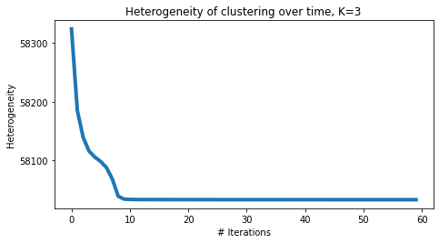
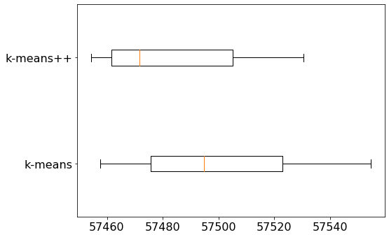

# k-means with text data

In this assignment you will
* Cluster Wikipedia documents using k-means
* Explore the role of random initialization on the quality of the clustering
* Explore how results differ after changing the number of clusters
* Evaluate clustering, both quantitatively and qualitatively

When properly executed, clustering uncovers valuable insights from a set of unlabeled documents.

**Note to Amazon EC2 users**: To conserve memory, make sure to stop all the other notebooks before running this notebook.

## Import necessary packages


```python
from __future__ import print_function # to conform python 2.x print to python 3.x
import turicreate
import matplotlib.pyplot as plt
import numpy as np
import sys
import os
from scipy.sparse import csr_matrix
from sklearn.preprocessing import OneHotEncoder, LabelEncoder

%matplotlib inline
```

## Load data, extract features

To work with text data, we must first convert the documents into numerical features. As in the first assignment, let's extract TF-IDF features for each article.


```python
wiki = turicreate.SFrame('people_wiki.sframe/')
```


```python
wiki['tf_idf'] = turicreate.text_analytics.tf_idf(wiki['text'])
```

For the remainder of the assignment, we will use sparse matrices. Sparse matrices are matrices that have a small number of nonzero entries. A good data structure for sparse matrices would only store the nonzero entries to save space and speed up computation. SciPy provides a highly-optimized library for sparse matrices. Many matrix operations available for NumPy arrays are also available for SciPy sparse matrices.

We first convert the TF-IDF column (in dictionary format) into the SciPy sparse matrix format. We included plenty of comments for the curious; if you'd like, you may skip the next block and treat the function as a black box.


```python
def sframe_to_scipy(x, column_name):
    '''
    Convert a dictionary column of an SFrame into a sparse matrix format where
    each (row_id, column_id, value) triple corresponds to the value of
    x[row_id][column_id], where column_id is a key in the dictionary.
       
    Example
    >>> sparse_matrix, map_key_to_index = sframe_to_scipy(sframe, column_name)
    '''
    assert type(x[column_name][0]) == dict, \
        'The chosen column must be dict type, representing sparse data.'
    
    # 1. Add a row number (id)
    x = x.add_row_number()

    # 2. Stack will transform x to have a row for each unique (row, key) pair.
    x = x.stack(column_name, ['feature', 'value'])

    # Map feature words to integers 
    unique_words = sorted(x['feature'].unique())
    mapping = {word:i for i, word in enumerate(unique_words)}
    x['feature_id'] = x['feature'].apply(lambda x: mapping[x])

    # Create numpy arrays that contain the data for the sparse matrix.
    row_id = np.array(x['id'])
    col_id = np.array(x['feature_id'])
    data = np.array(x['value'])
    
    width = x['id'].max() + 1
    height = x['feature_id'].max() + 1
    
    # Create a sparse matrix.
    mat = csr_matrix((data, (row_id, col_id)), shape=(width, height))
    return mat, mapping
```


```python
%%time
# The conversion will take about a minute or two.
tf_idf, map_index_to_word = sframe_to_scipy(wiki, 'tf_idf')
```

    CPU times: user 2min 20s, sys: 12.4 s, total: 2min 32s
    Wall time: 52.3 s


The above matrix contains a TF-IDF score for each of the 59071 pages in the data set and each of the 547979 unique words.


```python
tf_idf.shape
```


    (59071, 547979)


## Normalize all vectors

As discussed in the previous assignment, Euclidean distance can be a poor metric of similarity between documents, as it unfairly penalizes long articles. For a reasonable assessment of similarity, we should disregard the length information and use length-agnostic metrics, such as cosine distance.

The k-means algorithm does not directly work with cosine distance, so we take an alternative route to remove length information: we normalize all vectors to be unit length. It turns out that Euclidean distance closely mimics cosine distance when all vectors are unit length. In particular, the squared Euclidean distance between any two vectors of length one is directly proportional to their cosine distance.

We can prove this as follows. Let $\mathbf{x}$ and $\mathbf{y}$ be normalized vectors, i.e. unit vectors, so that $\|\mathbf{x}\|=\|\mathbf{y}\|=1$. Write the squared Euclidean distance as the dot product of $(\mathbf{x} - \mathbf{y})$ to itself:
\begin{align*}
\|\mathbf{x} - \mathbf{y}\|^2 &= (\mathbf{x} - \mathbf{y})^T(\mathbf{x} - \mathbf{y})\\
                              &= (\mathbf{x}^T \mathbf{x}) - 2(\mathbf{x}^T \mathbf{y}) + (\mathbf{y}^T \mathbf{y})\\
                              &= \|\mathbf{x}\|^2 - 2(\mathbf{x}^T \mathbf{y}) + \|\mathbf{y}\|^2\\
                              &= 2 - 2(\mathbf{x}^T \mathbf{y})\\
                              &= 2(1 - (\mathbf{x}^T \mathbf{y}))\\
                              &= 2\left(1 - \frac{\mathbf{x}^T \mathbf{y}}{\|\mathbf{x}\|\|\mathbf{y}\|}\right)\\
                              &= 2\left[\text{cosine distance}\right]
\end{align*}

This tells us that two **unit vectors** that are close in Euclidean distance are also close in cosine distance. Thus, the k-means algorithm (which naturally uses Euclidean distances) on normalized vectors will produce the same results as clustering using cosine distance as a distance metric.

We import the [`normalize()` function](http://scikit-learn.org/stable/modules/generated/sklearn.preprocessing.normalize.html) from scikit-learn to normalize all vectors to unit length.


```python
from sklearn.preprocessing import normalize
tf_idf = normalize(tf_idf)
```

## Implement k-means

Let us implement the k-means algorithm. First, we choose an initial set of centroids. A common practice is to choose randomly from the data points.

**Note:** We specify a seed here, so that everyone gets the same answer. In practice, we highly recommend to use different seeds every time (for instance, by using the current timestamp).


```python
def get_initial_centroids(data, k, seed=None):
    '''Randomly choose k data points as initial centroids'''
    if seed is not None: # useful for obtaining consistent results
        np.random.seed(seed)
    n = data.shape[0] # number of data points
        
    # Pick K indices from range [0, N).
    rand_indices = np.random.randint(0, n, k)
    
    # Keep centroids as dense format, as many entries will be nonzero due to averaging.
    # As long as at least one document in a cluster contains a word,
    # it will carry a nonzero weight in the TF-IDF vector of the centroid.
    centroids = data[rand_indices,:].toarray()
    
    return centroids
```

After initialization, the k-means algorithm iterates between the following two steps:
1. Assign each data point to the closest centroid.
$$
z_i \gets \mathrm{argmin}_j \|\mu_j - \mathbf{x}_i\|^2
$$
2. Revise centroids as the mean of the assigned data points.
$$
\mu_j \gets \frac{1}{n_j}\sum_{i:z_i=j} \mathbf{x}_i
$$

In pseudocode, we iteratively do the following:
```
cluster_assignment = assign_clusters(data, centroids)
centroids = revise_centroids(data, k, cluster_assignment)
```

### Assigning clusters

How do we implement Step 1 of the main k-means loop above? First import `pairwise_distances` function from scikit-learn, which calculates Euclidean distances between rows of given arrays. See [this documentation](http://scikit-learn.org/stable/modules/generated/sklearn.metrics.pairwise.pairwise_distances.html) for more information.

For the sake of demonstration, let's look at documents 100 through 102 as query documents and compute the distances between each of these documents and every other document in the corpus. In the k-means algorithm, we will have to compute pairwise distances between the set of centroids and the set of documents.


```python
from sklearn.metrics import pairwise_distances

# Get the TF-IDF vectors for documents 100 through 102.
queries = tf_idf[100:102,:]

# Compute pairwise distances from every data point to each query vector.
dist = pairwise_distances(tf_idf, queries, metric='euclidean')

print(dist)
```

    [[1.41000789 1.36894636]
     [1.40935215 1.41023886]
     [1.39855967 1.40890299]
     ...
     [1.41108296 1.39123646]
     [1.41022804 1.31468652]
     [1.39899784 1.41072448]]


More formally, `dist[i,j]` is assigned the distance between the `i`th row of `X` (i.e., `X[i,:]`) and the `j`th row of `Y` (i.e., `Y[j,:]`).

**Checkpoint:** For a moment, suppose that we initialize three centroids with the first 3 rows of `tf_idf`. Write code to compute distances from each of the centroids to all data points in `tf_idf`. Then find the distance between row 430 of `tf_idf` and the second centroid and save it to `dist`.


```python
# Students should write code here
queries = tf_idf[0:3,:]
dist = pairwise_distances(tf_idf[430], queries[1,:], metric='euclidean')
```


```python
'''Test cell'''
if np.allclose(dist, pairwise_distances(tf_idf[430,:], tf_idf[1,:])):
    print('Pass')
else:
    print('Check your code again')
```

    Pass


**Checkpoint:** Next, given the pairwise distances, we take the minimum of the distances for each data point. Fittingly, NumPy provides an `argmin` function. See [this documentation](http://docs.scipy.org/doc/numpy-1.10.1/reference/generated/numpy.argmin.html) for details.

Read the documentation and write code to produce a 1D array whose i-th entry indicates the centroid that is the closest to the i-th data point. Use the list of distances from the previous checkpoint and save them as `distances`. The value 0 indicates closeness to the first centroid, 1 indicates closeness to the second centroid, and so forth. Save this array as `closest_cluster`.

**Hint:** the resulting array should be as long as the number of data points.


```python
# Students should write code here
distances = pairwise_distances(tf_idf, queries, metric='euclidean')
closest_cluster = []
for row in distances:
    closest_cluster.append(np.argmin(row))
```


```python
'''Test cell'''
reference = [list(row).index(min(row)) for row in distances]
if np.allclose(closest_cluster, reference):
    print('Pass')
else:
    print('Check your code again')
```

    Pass


**Checkpoint:** Let's put these steps together.  First, initialize three centroids with the first 3 rows of `tf_idf`. Then, compute distances from each of the centroids to all data points in `tf_idf`. Finally, use these distance calculations to compute cluster assignments and assign them to `cluster_assignment`.


```python
# Students should write code here
centroids = tf_idf[0:3,:]
distances = pairwise_distances(tf_idf, centroids, metric='euclidean')
cluster_assignment = []
for row in distances:
    cluster_assignment.append(np.argmin(row))
```


```python
if len(cluster_assignment)==59071 and \
   np.array_equal(np.bincount(cluster_assignment), np.array([23061, 10086, 25924])):
    print('Pass') # count number of data points for each cluster
else:
    print('Check your code again.')
```

    Pass


Now we are ready to fill in the blanks in this function:


```python
def assign_clusters(data, centroids):
    
    # Compute distances between each data point and the set of centroids:
    # Fill in the blank (RHS only)
    distances_from_centroids = pairwise_distances(data, centroids, metric='euclidean')   # YOUR CODE HERE
    
    # Compute cluster assignments for each data point:
    # Fill in the blank (RHS only)
    cluster_assignment = []   # YOUR CODE HERE
    for row in distances_from_centroids:
        cluster_assignment.append(np.argmin(row))
    
    return np.array(cluster_assignment)
```

**Checkpoint**. For the last time, let us check if Step 1 was implemented correctly. With rows 0, 2, 4, and 6 of `tf_idf` as an initial set of centroids, we assign cluster labels to rows 0, 10, 20, ..., and 90 of `tf_idf`. The resulting cluster labels should be `[0, 1, 1, 0, 0, 2, 0, 2, 2, 1]`.


```python
if np.allclose(assign_clusters(tf_idf[0:100:10], tf_idf[0:8:2]), np.array([0, 1, 1, 0, 0, 2, 0, 2, 2, 1])):
    print('Pass')
else:
    print('Check your code again.')
```

    Pass


### Revising clusters

Let's turn to Step 2, where we compute the new centroids given the cluster assignments. 

SciPy and NumPy arrays allow for filtering via Boolean masks. For instance, we filter all data points that are assigned to cluster 0 by writing
```
data[cluster_assignment==0,:]
```

To develop intuition about filtering, let's look at a toy example consisting of 3 data points and 2 clusters.


```python
data = np.array([[1., 2., 0.],
                 [0., 0., 0.],
                 [2., 2., 0.]])
centroids = np.array([[0.5, 0.5, 0.],
                      [0., -0.5, 0.]])
```

Let's assign these data points to the closest centroid.


```python
cluster_assignment = assign_clusters(data, centroids)
print(cluster_assignment)
```

    [0 1 0]


The expression `cluster_assignment==1` gives a list of Booleans that says whether each data point is assigned to cluster 1 or not:


```python
#cluster_assignment==1
np.equal(cluster_assignment, 1)
```


    array([False,  True, False])


Likewise for cluster 0:


```python
#cluster_assignment==0
np.equal(cluster_assignment, 0)
```


    array([ True, False,  True])


In lieu of indices, we can put in the list of Booleans to pick and choose rows. Only the rows that correspond to a `True` entry will be retained.

First, let's look at the data points (i.e., their values) assigned to cluster 1:


```python
#data[cluster_assignment==1]
data[np.equal(cluster_assignment, 1)]
```


    array([[0., 0., 0.]])


This makes sense since [0 0 0] is closer to [0 -0.5 0] than to [0.5 0.5 0].

Now let's look at the data points assigned to cluster 0:


```python
data[np.equal(cluster_assignment, 0)]
```


    array([[1., 2., 0.],
           [2., 2., 0.]])


Again, this makes sense since these values are each closer to [0.5 0.5 0] than to [0 -0.5 0].

Given all the data points in a cluster, it only remains to compute the mean. Use [np.mean()](http://docs.scipy.org/doc/numpy-1.10.0/reference/generated/numpy.mean.html). By default, the function averages all elements in a 2D array. To compute row-wise or column-wise means, add the `axis` argument. See the linked documentation for details. 

Use this function to average the data points in cluster 0:


```python
data[np.equal(cluster_assignment, 0)].mean(axis=0)
```


    array([1.5, 2. , 0. ])


We are now ready to complete this function:


```python
def revise_centroids(data, k, cluster_assignment):
    new_centroids = []
    for i in range(k):
        # Select all data points that belong to cluster i. Fill in the blank (RHS only)
        member_data_points = data[np.equal(cluster_assignment, i)]   # YOUR CODE HERE
        # Compute the mean of the data points. Fill in the blank (RHS only)
        centroid = data[np.equal(cluster_assignment, i)].mean(axis=0)   # YOUR CODE HERE
        
        # Convert numpy.matrix type to numpy.ndarray type
        centroid = centroid.A1
        new_centroids.append(centroid)
    new_centroids = np.array(new_centroids)
    
    return new_centroids
```

**Checkpoint**. Let's check our Step 2 implementation. Letting rows 0, 10, ..., 90 of `tf_idf` as the data points and the cluster labels `[0, 1, 1, 0, 0, 2, 0, 2, 2, 1]`, we compute the next set of centroids. Each centroid is given by the average of all member data points in corresponding cluster.


```python
result = revise_centroids(tf_idf[0:100:10], 3, np.array([0, 1, 1, 0, 0, 2, 0, 2, 2, 1]))
if np.allclose(result[0], np.mean(tf_idf[[0,30,40,60]].toarray(), axis=0)) and \
   np.allclose(result[1], np.mean(tf_idf[[10,20,90]].toarray(), axis=0))   and \
   np.allclose(result[2], np.mean(tf_idf[[50,70,80]].toarray(), axis=0)):
    print('Pass')
else:
    print('Check your code')
```

    Pass


### Assessing convergence

How can we tell if the k-means algorithm is converging? We can look at the cluster assignments and see if they stabilize over time. In fact, we'll be running the algorithm until the cluster assignments stop changing at all. To be extra safe, and to assess the clustering performance, we'll be looking at an additional criteria: the sum of all squared distances between data points and centroids. This is defined as
$$
J(\mathcal{Z},\mu) = \sum_{j=1}^k \sum_{i:z_i = j} \|\mathbf{x}_i - \mu_j\|^2.
$$
The smaller the distances, the more homogeneous the clusters are. In other words, we'd like to have "tight" clusters.


```python
def compute_heterogeneity(data, k, centroids, cluster_assignment):
    
    heterogeneity = 0.0
    for i in range(k):
        
        # Select all data points that belong to cluster i. Fill in the blank (RHS only)
        member_data_points = data[cluster_assignment==i, :]
        
        if member_data_points.shape[0] > 0: # check if i-th cluster is non-empty
            # Compute distances from centroid to data points (RHS only)
            distances = pairwise_distances(member_data_points, [centroids[i]], metric='euclidean')
            squared_distances = distances**2
            heterogeneity += np.sum(squared_distances)
        
    return heterogeneity
```

Let's compute the cluster heterogeneity for the 2-cluster example we've been considering based on our current cluster assignments and centroids.


```python
compute_heterogeneity(data, 2, centroids, cluster_assignment)
```


    7.25


### Combining into a single function

Once the two k-means steps have been implemented, as well as our heterogeneity metric we wish to monitor, it is only a matter of putting these functions together to write a k-means algorithm that

* Repeatedly performs Steps 1 and 2
* Tracks convergence metrics
* Stops if either no assignment changed or we reach a certain number of iterations.


```python
# Fill in the blanks
def kmeans(data, k, initial_centroids, maxiter, record_heterogeneity=None, verbose=False):
    '''This function runs k-means on given data and initial set of centroids.
       maxiter: maximum number of iterations to run.
       record_heterogeneity: (optional) a list, to store the history of heterogeneity as function of iterations
                             if None, do not store the history.
       verbose: if True, print how many data points changed their cluster labels in each iteration'''
    centroids = initial_centroids[:]
    prev_cluster_assignment = None
    
    for itr in range(maxiter):        
        if verbose:
            print(itr)
        
        # 1. Make cluster assignments using nearest centroids
        # YOUR CODE HERE
        cluster_assignment = assign_clusters(data, centroids)
            
        # 2. Compute a new centroid for each of the k clusters, averaging all data points assigned to that cluster.
        # YOUR CODE HERE
        centroids = revise_centroids(data, k, cluster_assignment)
            
        # Check for convergence: if none of the assignments changed, stop
        if prev_cluster_assignment is not None and \
          (prev_cluster_assignment==cluster_assignment).all():
            break
        
        # Print number of new assignments 
        if prev_cluster_assignment is not None:
            num_changed = np.sum(prev_cluster_assignment!=cluster_assignment)
            if verbose:
                print('    {0:5d} elements changed their cluster assignment.'.format(num_changed))   
        
        # Record heterogeneity convergence metric
        if record_heterogeneity is not None:
            # YOUR CODE HERE
            score = compute_heterogeneity(data, k, centroids, cluster_assignment)
            record_heterogeneity.append(score)
        
        prev_cluster_assignment = cluster_assignment[:]
        
    return centroids, cluster_assignment
```

## Plotting convergence metric

We can use the above function to plot the convergence metric across iterations.


```python
def plot_heterogeneity(heterogeneity, k):
    plt.figure(figsize=(7,4))
    plt.plot(heterogeneity, linewidth=4)
    plt.xlabel('# Iterations')
    plt.ylabel('Heterogeneity')
    plt.title('Heterogeneity of clustering over time, K={0:d}'.format(k))
    plt.rcParams.update({'font.size': 16})
    plt.tight_layout()
```

Let's consider running k-means with K=3 clusters for a maximum of 400 iterations, recording cluster heterogeneity at every step.  Then, let's plot the heterogeneity over iterations using the plotting function above.


```python
k = 3
heterogeneity = []
initial_centroids = get_initial_centroids(tf_idf, k, seed=0)
centroids, cluster_assignment = kmeans(tf_idf, k, initial_centroids, maxiter=400,
                                       record_heterogeneity=heterogeneity, verbose=True)
plot_heterogeneity(heterogeneity, k)
```

    0
    1
        19157 elements changed their cluster assignment.
    2
         7739 elements changed their cluster assignment.
    3
         5119 elements changed their cluster assignment.
    4
         3370 elements changed their cluster assignment.
    5
         2811 elements changed their cluster assignment.
    6
         3233 elements changed their cluster assignment.
    7
         3815 elements changed their cluster assignment.
    8
         3172 elements changed their cluster assignment.
    9
         1149 elements changed their cluster assignment.
    10
          498 elements changed their cluster assignment.
    11
          265 elements changed their cluster assignment.
    12
          149 elements changed their cluster assignment.
    13
          100 elements changed their cluster assignment.
    14
           76 elements changed their cluster assignment.
    15
           67 elements changed their cluster assignment.
    16
           51 elements changed their cluster assignment.
    17
           47 elements changed their cluster assignment.
    18
           40 elements changed their cluster assignment.
    19
           34 elements changed their cluster assignment.
    20
           35 elements changed their cluster assignment.
    21
           39 elements changed their cluster assignment.
    22
           24 elements changed their cluster assignment.
    23
           16 elements changed their cluster assignment.
    24
           12 elements changed their cluster assignment.
    25
           14 elements changed their cluster assignment.
    26
           17 elements changed their cluster assignment.
    27
           15 elements changed their cluster assignment.
    28
           14 elements changed their cluster assignment.
    29
           16 elements changed their cluster assignment.
    30
           21 elements changed their cluster assignment.
    31
           22 elements changed their cluster assignment.
    32
           33 elements changed their cluster assignment.
    33
           35 elements changed their cluster assignment.
    34
           39 elements changed their cluster assignment.
    35
           36 elements changed their cluster assignment.
    36
           36 elements changed their cluster assignment.
    37
           25 elements changed their cluster assignment.
    38
           27 elements changed their cluster assignment.
    39
           25 elements changed their cluster assignment.
    40
           28 elements changed their cluster assignment.
    41
           35 elements changed their cluster assignment.
    42
           31 elements changed their cluster assignment.
    43
           25 elements changed their cluster assignment.
    44
           18 elements changed their cluster assignment.
    45
           15 elements changed their cluster assignment.
    46
           10 elements changed their cluster assignment.
    47
            8 elements changed their cluster assignment.
    48
            8 elements changed their cluster assignment.
    49
            8 elements changed their cluster assignment.
    50
            7 elements changed their cluster assignment.
    51
            8 elements changed their cluster assignment.
    52
            3 elements changed their cluster assignment.
    53
            3 elements changed their cluster assignment.
    54
            4 elements changed their cluster assignment.
    55
            2 elements changed their cluster assignment.
    56
            3 elements changed their cluster assignment.
    57
            3 elements changed their cluster assignment.
    58
            1 elements changed their cluster assignment.
    59
            1 elements changed their cluster assignment.
    60





**Quiz Question**. (True/False) The clustering objective (heterogeneity) is non-increasing for this example. True

**Quiz Question**. Let's step back from this particular example. If the clustering objective (heterogeneity) would ever increase when running k-means, that would indicate: (choose one)

1. k-means algorithm got stuck in a bad local minimum <------
2. There is a bug in the k-means code
3. All data points consist of exact duplicates
4. Nothing is wrong. The objective should generally go down sooner or later.

**Quiz Question**. Which of the cluster contains the greatest number of data points in the end? Hint: Use [`np.bincount()`](http://docs.scipy.org/doc/numpy-1.11.0/reference/generated/numpy.bincount.html) to count occurrences of each cluster label.
 1. Cluster #0
 2. Cluster #1
 3. Cluster #2 <------


```python
np.bincount(cluster_assignment)
```


    array([19595, 10427, 29049])


## Beware of local maxima

One weakness of k-means is that it tends to get stuck in a local minimum. To see this, let us run k-means multiple times, with different initial centroids created using different random seeds.

**Note:** Again, in practice, you should set different seeds for every run. We give you a list of seeds for this assignment so that everyone gets the same answer.

This may take several minutes to run.


```python
k = 10
heterogeneity = {}
cluster_assignment_dict = {}
import time
start = time.time()
for seed in [0, 20000, 40000, 60000, 80000, 100000, 120000]:
    initial_centroids = get_initial_centroids(tf_idf, k, seed)
    centroids, cluster_assignment = kmeans(tf_idf, k, initial_centroids, maxiter=400,
                                           record_heterogeneity=None, verbose=False)
    # To save time, compute heterogeneity only once in the end
    heterogeneity[seed] = compute_heterogeneity(tf_idf, k, centroids, cluster_assignment)

    # This is the line we added for the next quiz question
    cluster_assignment_dict[seed] = np.bincount(cluster_assignment)
    
#    print('seed={0:06d}, heterogeneity={1:.5f}'.format(seed, heterogeneity[seed]))
    # And this is the modified print statement
    print('seed={0:06d}, heterogeneity={1:.5f}, cluster_distribution={2}'.format(seed, heterogeneity[seed], 
                                           cluster_assignment_dict[seed]))
    sys.stdout.flush()
end = time.time()
print(end-start)
```

    seed=000000, heterogeneity=57457.52442, cluster_distribution=[18047  3824  5671  6983  1492  1730  3882  3449  7139  6854]
    seed=020000, heterogeneity=57533.20100, cluster_distribution=[ 3142   768  3566  2277 15779  7278  6146  7964  6666  5485]
    seed=040000, heterogeneity=57512.69257, cluster_distribution=[ 5551  6623   186  2999  8487  3893  6807  2921  3472 18132]
    seed=060000, heterogeneity=57466.97925, cluster_distribution=[ 3014  3089  6681  3856  8080  7222  3424   424  5381 17900]
    seed=080000, heterogeneity=57494.92990, cluster_distribution=[17582  1785  7215  3314  6285   809  5930  6791  5536  3824]
    seed=100000, heterogeneity=57484.42210, cluster_distribution=[ 6618  1337  6191  2890 16969  4983  5242  3892  5562  5387]
    seed=120000, heterogeneity=57554.62410, cluster_distribution=[ 6118  5841  4964  8423  4302  3183 16481  1608  5524  2627]
    205.65315508842468


Notice the variation in heterogeneity for different initializations. This indicates that k-means sometimes gets stuck at a bad local minimum.

**Quiz Question**. Another way to capture the effect of changing initialization is to look at the distribution of cluster assignments. Add a line to the code above to compute the size (# of member data points) of clusters for each run of k-means. Look at the size of the largest cluster (most # of member data points) across multiple runs, with seeds 0, 20000, ..., 120000. How much does this measure vary across the runs? What is the minimum and maximum values this quantity takes? 186, 18132

One effective way to counter this tendency is to use **k-means++** to provide a smart initialization. This method tries to spread out the initial set of centroids so that they are not too close together. It is known to improve the quality of local optima and lower average runtime.


```python
def smart_initialize(data, k, seed=None):
    '''Use k-means++ to initialize a good set of centroids'''
    if seed is not None: # useful for obtaining consistent results
        np.random.seed(seed)
    centroids = np.zeros((k, data.shape[1]))
    
    # Randomly choose the first centroid.
    # Since we have no prior knowledge, choose uniformly at random
    idx = np.random.randint(data.shape[0])
    centroids[0] = data[idx,:].toarray()
    # Compute distances from the first centroid chosen to all the other data points
    squared_distances = pairwise_distances(data, centroids[0:1], metric='euclidean').flatten()**2
    
    for i in range(1, k):
        # Choose the next centroid randomly, so that the probability for each data point to be chosen
        # is directly proportional to its squared distance from the nearest centroid.
        # Roughtly speaking, a new centroid should be as far as from ohter centroids as possible.
        idx = np.random.choice(data.shape[0], 1, p=squared_distances/sum(squared_distances))
        centroids[i] = data[idx,:].toarray()
        # Now compute distances from the centroids to all data points
        squared_distances = np.min(pairwise_distances(data, centroids[0:i+1], metric='euclidean')**2,axis=1)
    
    return centroids
```

Let's now rerun k-means with 10 clusters using the same set of seeds, but always using k-means++ to initialize the algorithm.

This may take several minutes to run.


```python
%%time 

k = 10
heterogeneity_smart = {}
seeds = [0, 20000, 40000, 60000, 80000, 100000, 120000]
for seed in seeds:
    initial_centroids = smart_initialize(tf_idf, k, seed)
    centroids, cluster_assignment = kmeans(tf_idf, k, initial_centroids, maxiter=400,
                                           record_heterogeneity=None, verbose=False)
    # To save time, compute heterogeneity only once in the end
    heterogeneity_smart[seed] = compute_heterogeneity(tf_idf, k, centroids, cluster_assignment)
    print('seed={0:06d}, heterogeneity={1:.5f}'.format(seed, heterogeneity_smart[seed]))
    sys.stdout.flush()

```

    seed=000000, heterogeneity=57468.63808
    seed=020000, heterogeneity=57486.94263
    seed=040000, heterogeneity=57454.35926
    seed=060000, heterogeneity=57530.43659
    seed=080000, heterogeneity=57454.51852
    seed=100000, heterogeneity=57471.56674
    seed=120000, heterogeneity=57523.28839
    CPU times: user 3min 26s, sys: 46.9 s, total: 4min 13s
    Wall time: 4min 13s


Let's compare the set of cluster heterogeneities we got from our 7 restarts of k-means using random initialization compared to the 7 restarts of k-means using k-means++ as a smart initialization.

The following code produces a [box plot](http://matplotlib.org/api/pyplot_api.html) for each of these methods, indicating the spread of values produced by each method.


```python
plt.figure(figsize=(8,5))
plt.boxplot([list(heterogeneity.values()), list(heterogeneity_smart.values())], vert=False)
plt.yticks([1, 2], ['k-means', 'k-means++'])
plt.rcParams.update({'font.size': 16})
plt.tight_layout()
```





A few things to notice from the box plot:
* On average, k-means++ produces a better clustering than Random initialization.
* Variation in clustering quality is smaller for k-means++.

**In general, you should run k-means at least a few times with different initializations and then return the run resulting in the lowest heterogeneity.** Let us write a function that runs k-means multiple times and picks the best run that minimizes heterogeneity. The function accepts an optional list of seed values to be used for the multiple runs; if no such list is provided, the current UTC time is used as seed values.


```python
def kmeans_multiple_runs(data, k, maxiter, num_runs, seed_list=None, verbose=False):
    heterogeneity = {}
    
    min_heterogeneity_achieved = float('inf')
    best_seed = None
    final_centroids = None
    final_cluster_assignment = None
    
    for i in range(num_runs):
        
        # Use UTC time if no seeds are provided 
        if seed_list is not None: 
            seed = seed_list[i]
            np.random.seed(seed)
        else: 
            seed = int(time.time())
            np.random.seed(seed)
        
        # Use k-means++ initialization
        # YOUR CODE HERE
        initial_centroids = smart_initialize(data, k, seed)
        
        # Run k-means
        # YOUR CODE HERE
        centroids, cluster_assignment = kmeans(data, k, initial_centroids, maxiter, verbose=False)
        
        # To save time, compute heterogeneity only once in the end
        # YOUR CODE HERE
        heterogeneity[seed] = compute_heterogeneity(data, k, centroids, cluster_assignment)
        
        if verbose:
            print('seed={0:06d}, heterogeneity={1:.5f}'.format(seed, heterogeneity[seed]))
            sys.stdout.flush()
        
        # if current measurement of heterogeneity is lower than previously seen,
        # update the minimum record of heterogeneity.
        if heterogeneity[seed] < min_heterogeneity_achieved:
            min_heterogeneity_achieved = heterogeneity[seed]
            best_seed = seed
            final_centroids = centroids
            final_cluster_assignment = cluster_assignment
    
    # Return the centroids and cluster assignments that minimize heterogeneity.
    return final_centroids, final_cluster_assignment
```

## How to choose K

Since we are measuring the tightness of the clusters, a higher value of K reduces the possible heterogeneity metric by definition.  For example, if we have N data points and set K=N clusters, then we could have 0 cluster heterogeneity by setting the N centroids equal to the values of the N data points. (Note: Not all runs for larger K will result in lower heterogeneity than a single run with smaller K due to local optima.)  Let's explore this general trend for ourselves by performing the following analysis.

Use the `kmeans_multiple_runs` function to run k-means with five different values of K.  For each K, use k-means++ and multiple runs to pick the best solution.  In what follows, we consider K=2,10,25,50,100 and 7 restarts for each setting.

**IMPORTANT: The code block below will take about 10 minutes to finish**

In order to speed up the computations, we run them with only one random seed, but for better performance, one should use more seeds and compare the results. If you don't mind running the code for approximately one hour, feel free to uncomment the following line of code below:

`seed_list = [0]#, 20000, 40000, 60000, 80000, 100000, 120000]`

Side note: In practice, a good implementation of k-means would utilize parallelism to run multiple runs of k-means at once. For an example, see [scikit-learn's KMeans](http://scikit-learn.org/stable/modules/generated/sklearn.cluster.KMeans.html).


```python
%%time
import numpy as np 

def plot_k_vs_heterogeneity(k_values, heterogeneity_values):
    plt.figure(figsize=(7,4))
    plt.plot(k_values, heterogeneity_values, linewidth=4)
    plt.xlabel('K')
    plt.ylabel('Heterogeneity')
    plt.title('K vs. Heterogeneity')
    plt.rcParams.update({'font.size': 16})
    plt.tight_layout()

centroids = {}
cluster_assignment = {}
heterogeneity_values = []
k_list = [2, 10, 25, 50, 100]
seed_list = [0]
# Uncomment the following line to run the plot with all the seeds (it may take about an hour to finish).
seed_list = [0, 20000, 40000, 60000, 80000, 100000, 120000]

for k in k_list:
    heterogeneity = []
    centroids[k], cluster_assignment[k] = kmeans_multiple_runs(tf_idf, k, maxiter=400,
                                                               num_runs=len(seed_list),                                                               seed_list=seed_list,
                                                               verbose=True)
    score = compute_heterogeneity(tf_idf, k, centroids[k], cluster_assignment[k])
    heterogeneity_values.append(score)
```

    seed=000000, heterogeneity=58224.59913
    seed=020000, heterogeneity=58179.57453
    seed=040000, heterogeneity=58179.57453
    seed=060000, heterogeneity=58179.57453
    seed=080000, heterogeneity=58224.59952
    seed=100000, heterogeneity=58179.57453
    seed=120000, heterogeneity=58179.57453
    seed=000000, heterogeneity=57468.63808
    seed=020000, heterogeneity=57486.94263
    seed=040000, heterogeneity=57454.35926
    seed=060000, heterogeneity=57530.43659
    seed=080000, heterogeneity=57454.51852
    seed=100000, heterogeneity=57471.56674
    seed=120000, heterogeneity=57523.28839
    seed=000000, heterogeneity=56913.24052
    seed=020000, heterogeneity=56961.01793
    seed=040000, heterogeneity=56904.99744
    seed=060000, heterogeneity=56858.67830
    seed=080000, heterogeneity=56955.74619
    seed=100000, heterogeneity=56973.02116
    seed=120000, heterogeneity=56934.20148
    seed=000000, heterogeneity=56399.72145
    seed=020000, heterogeneity=56322.64583
    seed=040000, heterogeneity=56314.32239
    seed=060000, heterogeneity=56278.53939
    seed=080000, heterogeneity=56353.54891
    seed=100000, heterogeneity=56303.94021
    seed=120000, heterogeneity=56361.37319
    seed=000000, heterogeneity=55649.66538
    seed=020000, heterogeneity=55587.56988
    seed=040000, heterogeneity=55720.24668
    seed=060000, heterogeneity=55616.64653
    seed=080000, heterogeneity=55672.95812
    seed=100000, heterogeneity=55660.45384
    seed=120000, heterogeneity=55735.28103
    CPU times: user 49min 23s, sys: 20min 33s, total: 1h 9min 57s
    Wall time: 1h 9min 57s


```python
plot_k_vs_heterogeneity(k_list, heterogeneity_values)
```


In the above plot we show that heterogeneity goes down as we increase the number of clusters. Does this mean we should always favor a higher K? **Not at all!** As we will see in the following section, setting K too high may end up separating data points that are actually pretty alike. At the extreme, we can set individual data points to be their own clusters (K=N) and achieve zero heterogeneity, but separating each data point into its own cluster is hardly a desirable outcome. In the following section, we will learn how to detect a K set "too large".

## Visualize clusters of documents

Let's start visualizing some clustering results to see if we think the clustering makes sense.  We can use such visualizations to help us assess whether we have set K too large or too small for a given application.  Following the theme of this course, we will judge whether the clustering makes sense in the context of document analysis.

What are we looking for in a good clustering of documents?
* Documents in the same cluster should be similar.
* Documents from different clusters should be less similar.

So a bad clustering exhibits either of two symptoms:
* Documents in a cluster have mixed content.
* Documents with similar content are divided up and put into different clusters.

To help visualize the clustering, we do the following:
* Fetch nearest neighbors of each centroid from the set of documents assigned to that cluster. We will consider these documents as being representative of the cluster.
* Print titles and first sentences of those nearest neighbors.
* Print top 5 words that have highest tf-idf weights in each centroid.


```python
def visualize_document_clusters(wiki, tf_idf, centroids, cluster_assignment, k, map_word_to_index, display_content=True):
    '''wiki: original dataframe
       tf_idf: data matrix, sparse matrix format
       map_index_to_word: SFrame specifying the mapping betweeen words and column indices
       display_content: if True, display 8 nearest neighbors of each centroid'''
    map_index_to_word =  {v:k for k,v in map_word_to_index.items()}
    print('==========================================================')
    # Visualize each cluster c
    for c in range(k):
        # Cluster heading
        print('Cluster {0:d}    '.format(c)),
        # Print top 5 words with largest TF-IDF weights in the cluster
        idx = centroids[c].argsort()[::-1]
        for i in range(5): # Print each word along with the TF-IDF weight
            print('{0:s}:{1:.3f}'.format(map_index_to_word[idx[i]], centroids[c][idx[i]])),
        print('')
        
        if display_content:
            # Compute distances from the centroid to all data points in the cluster,
            # and compute nearest neighbors of the centroids within the cluster.
            distances = pairwise_distances(tf_idf, centroids[c].reshape(1, -1), metric='euclidean').flatten()
            distances[cluster_assignment!=c] = float('inf') # remove non-members from consideration
            
            nearest_neighbors = distances.argsort()
            
            # For 8 nearest neighbors, print the title as well as first 180 characters of text.
            # Wrap the text at 80-character mark.
            for i in range(8):
                text = ' '.join(wiki[nearest_neighbors[i]]['text'].split(None, 25)[0:25])
                print('\n* {0:50s} {1:.5f}\n  {2:s}\n  {3:s}'.format(wiki[nearest_neighbors[i]]['name'],
                    distances[nearest_neighbors[i]], text[:90], text[90:180] if len(text) > 90 else ''))
        print('==========================================================')
```

Let us first look at the 2 cluster case (K=2).


```python
'''Notice the extra pairs of parentheses for centroids and cluster_assignment.
   The centroid and cluster_assignment are still inside the npz file,
   and we need to explicitly indicate when to load them into memory.'''
visualize_document_clusters(wiki, tf_idf, centroids[2], cluster_assignment[2], 2, map_index_to_word)
```

    ==========================================================
    Cluster 0    
    she:0.025
    her:0.017
    music:0.012
    he:0.011
    university:0.011
    
    
    * Anita Kunz                                         0.97401
      anita e kunz oc born 1956 is a canadianborn artist and illustratorkunz has lived in london
       new york and toronto contributing to magazines and working
    
    * Janet Jackson                                      0.97472
      janet damita jo jackson born may 16 1966 is an american singer songwriter and actress know
      n for a series of sonically innovative socially conscious and
    
    * Madonna (entertainer)                              0.97475
      madonna louise ciccone tkoni born august 16 1958 is an american singer songwriter actress 
      and businesswoman she achieved popularity by pushing the boundaries of lyrical
    
    * %C3%81ine Hyland                                   0.97536
      ine hyland ne donlon is emeritus professor of education and former vicepresident of univer
      sity college cork ireland she was born in 1942 in athboy co
    
    * Jane Fonda                                         0.97621
      jane fonda born lady jayne seymour fonda december 21 1937 is an american actress writer po
      litical activist former fashion model and fitness guru she is
    
    * Christine Robertson                                0.97643
      christine mary robertson born 5 october 1948 is an australian politician and former austra
      lian labor party member of the new south wales legislative council serving
    
    * Pat Studdy-Clift                                   0.97643
      pat studdyclift is an australian author specialising in historical fiction and nonfictionb
      orn in 1925 she lived in gunnedah until she was sent to a boarding
    
    * Alexandra Potter                                   0.97646
      alexandra potter born 1970 is a british author of romantic comediesborn in bradford yorksh
      ire england and educated at liverpool university gaining an honors degree in
    ==========================================================
    Cluster 1    
    league:0.040
    season:0.036
    team:0.029
    football:0.029
    played:0.028
    
    
    * Todd Williams                                      0.95468
      todd michael williams born february 13 1971 in syracuse new york is a former major league 
      baseball relief pitcher he attended east syracuseminoa high school
    
    * Gord Sherven                                       0.95622
      gordon r sherven born august 21 1963 in gravelbourg saskatchewan and raised in mankota sas
      katchewan is a retired canadian professional ice hockey forward who played
    
    * Justin Knoedler                                    0.95639
      justin joseph knoedler born july 17 1980 in springfield illinois is a former major league 
      baseball catcherknoedler was originally drafted by the st louis cardinals
    
    * Chris Day                                          0.95648
      christopher nicholas chris day born 28 july 1975 is an english professional footballer who
       plays as a goalkeeper for stevenageday started his career at tottenham
    
    * Tony Smith (footballer, born 1957)                 0.95653
      anthony tony smith born 20 february 1957 is a former footballer who played as a central de
      fender in the football league in the 1970s and
    
    * Ashley Prescott                                    0.95761
      ashley prescott born 11 september 1972 is a former australian rules footballer he played w
      ith the richmond and fremantle football clubs in the afl between
    
    * Leslie Lea                                         0.95802
      leslie lea born 5 october 1942 in manchester is an english former professional footballer 
      he played as a midfielderlea began his professional career with blackpool
    
    * Tommy Anderson (footballer)                        0.95818
      thomas cowan tommy anderson born 24 september 1934 in haddington is a scottish former prof
      essional footballer he played as a forward and was noted for
    ==========================================================


Both clusters have mixed content, although cluster 1 is much purer than cluster 0:
* Cluster 0: academia, law
* Cluster 1: female figures, baseball players

Roughly speaking, the entire dataset was divided into athletes and non-athletes. It would be better if we sub-divided non-atheletes into more categories. So let us use more clusters. How about `K=10`?


```python
k = 10
visualize_document_clusters(wiki, tf_idf, centroids[k], cluster_assignment[k], k, map_index_to_word)
```

    ==========================================================
    Cluster 0    
    film:0.020
    art:0.014
    he:0.011
    book:0.010
    television:0.010
    
    
    * Wilson McLean                                      0.97479
      wilson mclean born 1937 is a scottish illustrator and artist he has illustrated primarily 
      in the field of advertising but has also provided cover art
    
    * Anton Hecht                                        0.97748
      anton hecht is an english artist born in london in 2007 he asked musicians from around the
       durham area to contribute to a soundtrack for
    
    * David Salle                                        0.97800
      david salle born 1952 is an american painter printmaker and stage designer who helped defi
      ne postmodern sensibility salle was born in norman oklahoma he earned
    
    * Vipin Sharma                                       0.97805
      vipin sharma is an indian actor born in new delhi he is a graduate of national school of d
      rama new delhi india and the canadian
    
    * Paul Swadel                                        0.97823
      paul swadel is a new zealand film director and producerhe has directed and produced many s
      uccessful short films which have screened in competition at cannes
    
    * Allan Stratton                                     0.97834
      allan stratton born 1951 is a canadian playwright and novelistborn in stratford ontario st
      ratton began his professional arts career while he was still in high
    
    * Bill Bennett (director)                            0.97848
      bill bennett born 1953 is an australian film director producer and screenwriterhe dropped 
      out of medicine at queensland university in 1972 and joined the australian
    
    * Rafal Zielinski                                    0.97850
      rafal zielinski born 1957 montreal is an independent filmmaker he is best known for direct
      ing films such as fun sundance film festival special jury award
    ==========================================================
    Cluster 1    
    league:0.052
    rugby:0.044
    club:0.042
    cup:0.042
    season:0.041
    
    
    * Chris Day                                          0.93220
      christopher nicholas chris day born 28 july 1975 is an english professional footballer who
       plays as a goalkeeper for stevenageday started his career at tottenham
    
    * Gary Hooper                                        0.93481
      gary hooper born 26 january 1988 is an english professional footballer who plays as a forw
      ard for norwich cityhooper started his career at nonleague grays
    
    * Tony Smith (footballer, born 1957)                 0.93504
      anthony tony smith born 20 february 1957 is a former footballer who played as a central de
      fender in the football league in the 1970s and
    
    * Jason Roberts (footballer)                         0.93527
      jason andre davis roberts mbe born 25 january 1978 is a former professional footballer and
       now a football punditborn in park royal london roberts was
    
    * Paul Robinson (footballer, born 1979)              0.93587
      paul william robinson born 15 october 1979 is an english professional footballer who plays
       for blackburn rovers as a goalkeeper he is a former england
    
    * Alex Lawless                                       0.93732
      alexander graham alex lawless born 26 march 1985 is a welsh professional footballer who pl
      ays for luton town as a midfielderlawless began his career with
    
    * Neil Grayson                                       0.93748
      neil grayson born 1 november 1964 in york is an english footballer who last played as a st
      riker for sutton towngraysons first club was local
    
    * Sol Campbell                                       0.93759
      sulzeer jeremiah sol campbell born 18 september 1974 is a former england international foo
      tballer a central defender he had a 19year career playing in the
    ==========================================================
    Cluster 2    
    championships:0.040
    tour:0.037
    championship:0.032
    world:0.029
    won:0.029
    
    
    * Alessandra Aguilar                                 0.94505
      alessandra aguilar born 1 july 1978 in lugo is a spanish longdistance runner who specialis
      es in marathon running she represented her country in the event
    
    * Heather Samuel                                     0.94529
      heather barbara samuel born 6 july 1970 is a retired sprinter from antigua and barbuda who
       specialized in the 100 and 200 metres in 1990
    
    * Viola Kibiwot                                      0.94617
      viola jelagat kibiwot born december 22 1983 in keiyo district is a runner from kenya who s
      pecialises in the 1500 metres kibiwot won her first
    
    * Ayelech Worku                                      0.94636
      ayelech worku born june 12 1979 is an ethiopian longdistance runner most known for winning
       two world championships bronze medals on the 5000 metres she
    
    * Morhad Amdouni                                     0.94763
      morhad amdouni born 21 january 1988 in portovecchio is a french middle and longdistance ru
      nner he was european junior champion in track and cross country
    
    * Krisztina Papp                                     0.94776
      krisztina papp born 17 december 1982 in eger is a hungarian long distance runner she is th
      e national indoor record holder over 5000 mpapp began
    
    * Petra Lammert                                      0.94869
      petra lammert born 3 march 1984 in freudenstadt badenwrttemberg is a former german shot pu
      tter and current bobsledder she was the 2009 european indoor champion
    
    * Hasan Mahboob                                      0.94880
      hasan mahboob ali born silas kirui on 31 december 1981 in kapsabet is a bahraini longdista
      nce runner he became naturalized in bahrain and switched from
    ==========================================================
    Cluster 3    
    baseball:0.110
    league:0.103
    major:0.052
    games:0.047
    season:0.045
    
    
    * Steve Springer                                     0.89300
      steven michael springer born february 11 1961 is an american former professional baseball 
      player who appeared in major league baseball as a third baseman and
    
    * Dave Ford                                          0.89547
      david alan ford born december 29 1956 is a former major league baseball pitcher for the ba
      ltimore orioles born in cleveland ohio ford attended lincolnwest
    
    * Todd Williams                                      0.89820
      todd michael williams born february 13 1971 in syracuse new york is a former major league 
      baseball relief pitcher he attended east syracuseminoa high school
    
    * Justin Knoedler                                    0.90035
      justin joseph knoedler born july 17 1980 in springfield illinois is a former major league 
      baseball catcherknoedler was originally drafted by the st louis cardinals
    
    * Kevin Nicholson (baseball)                         0.90643
      kevin ronald nicholson born march 29 1976 is a canadian baseball shortstop he played part 
      of the 2000 season for the san diego padres of
    
    * James Baldwin (baseball)                           0.90648
      james j baldwin jr born july 15 1971 is a former major league baseball pitcher he batted a
      nd threw righthanded in his 11season career he
    
    * Joe Strong                                         0.90655
      joseph benjamin strong born september 9 1962 in fairfield california is a former major lea
      gue baseball pitcher who played for the florida marlins from 2000
    
    * Javier L%C3%B3pez (baseball)                       0.90691
      javier alfonso lpez born july 11 1977 is a puerto rican professional baseball pitcher for 
      the san francisco giants of major league baseball he is
    ==========================================================
    Cluster 4    
    research:0.038
    university:0.035
    professor:0.032
    science:0.023
    institute:0.019
    
    
    * Lawrence W. Green                                  0.95957
      lawrence w green is best known by health education researchers as the originator of the pr
      ecede model and codeveloper of the precedeproceed model which has
    
    * Timothy Luke                                       0.96057
      timothy w luke is university distinguished professor of political science in the college o
      f liberal arts and human sciences as well as program chair of
    
    * Ren%C3%A9e Fox                                     0.96100
      rene c fox a summa cum laude graduate of smith college in 1949 earned her phd in sociology
       in 1954 from radcliffe college harvard university
    
    * Francis Gavin                                      0.96323
      francis j gavin is first frank stanton chair in nuclear security policy studies and profes
      sor of political science at mit before joining mit he was
    
    * Catherine Hakim                                    0.96374
      catherine hakim born 30 may 1948 is a british sociologist who specialises in womens employ
      ment and womens issues she is currently a professorial research fellow
    
    * Stephen Park Turner                                0.96405
      stephen turner is a researcher in social practice social and political theory and the phil
      osophy of the social sciences he is graduate research professor in
    
    * Robert Bates (political scientist)                 0.96489
      robert hinrichs bates born 1942 is an american political scientist he is eaton professor o
      f the science of government in the departments of government and
    
    * Georg von Krogh                                    0.96505
      georg von krogh was born in oslo norway he is a professor at eth zurich and holds the chai
      r of strategic management and innovation he
    ==========================================================
    Cluster 5    
    football:0.076
    coach:0.060
    basketball:0.056
    season:0.044
    played:0.037
    
    
    * Todd Curley                                        0.92731
      todd curley born 14 january 1973 is a former australian rules footballer who played for co
      llingwood and the western bulldogs in the australian football league
    
    * Ashley Prescott                                    0.92992
      ashley prescott born 11 september 1972 is a former australian rules footballer he played w
      ith the richmond and fremantle football clubs in the afl between
    
    * Pete Richardson                                    0.93204
      pete richardson born october 17 1946 in youngstown ohio is a former american football defe
      nsive back in the national football league and former college head
    
    * Nathan Brown (Australian footballer born 1976)     0.93561
      nathan daniel brown born 14 august 1976 is an australian rules footballer who played for t
      he melbourne demons in the australian football leaguehe was drafted
    
    * Earl Spalding                                      0.93654
      earl spalding born 11 march 1965 in south perth is a former australian rules footballer wh
      o played for melbourne and carlton in the victorian football
    
    * Bud Grant                                          0.93766
      harry peter bud grant jr born may 20 1927 is a former american football and canadian footb
      all head coach grant served as the head coach
    
    * Tyrone Wheatley                                    0.93885
      tyrone anthony wheatley born january 19 1972 is the running backs coach of michigan and a 
      former professional american football player who played 10 seasons
    
    * Nick Salter                                        0.93916
      nick salter born 30 july 1987 is an australian rules footballer who played for port adelai
      de football club in the australian football league aflhe was
    ==========================================================
    Cluster 6    
    she:0.138
    her:0.089
    actress:0.014
    film:0.013
    miss:0.012
    
    
    * Lauren Royal                                       0.93445
      lauren royal born march 3 circa 1965 is a book writer from california royal has written bo
      th historic and novelistic booksa selfproclaimed angels baseball fan
    
    * Barbara Hershey                                    0.93496
      barbara hershey born barbara lynn herzstein february 5 1948 once known as barbara seagull 
      is an american actress in a career spanning nearly 50 years
    
    * Janet Jackson                                      0.93559
      janet damita jo jackson born may 16 1966 is an american singer songwriter and actress know
      n for a series of sonically innovative socially conscious and
    
    * Jane Fonda                                         0.93759
      jane fonda born lady jayne seymour fonda december 21 1937 is an american actress writer po
      litical activist former fashion model and fitness guru she is
    
    * Janine Shepherd                                    0.93833
      janine lee shepherd am born 1962 is an australian pilot and former crosscountry skier shep
      herds career as an athlete ended when she suffered major injuries
    
    * Ellina Graypel                                     0.93847
      ellina graypel born july 19 1972 is an awardwinning russian singersongwriter she was born 
      near the volga river in the heart of russia she spent
    
    * Alexandra Potter                                   0.93858
      alexandra potter born 1970 is a british author of romantic comediesborn in bradford yorksh
      ire england and educated at liverpool university gaining an honors degree in
    
    * Melissa Hart (actress)                             0.93913
      melissa hart is an american actress singer and teacher she made her broadway debut in 1966
       as an ensemble member in jerry bocks the apple
    ==========================================================
    Cluster 7    
    music:0.057
    album:0.040
    band:0.035
    orchestra:0.023
    released:0.022
    
    
    * Brenton Broadstock                                 0.95722
      brenton broadstock ao born 1952 is an australian composerbroadstock was born in melbourne 
      he studied history politics and music at monash university and later composition
    
    * Prince (musician)                                  0.96057
      prince rogers nelson born june 7 1958 known by his mononym prince is an american singerson
      gwriter multiinstrumentalist and actor he has produced ten platinum albums
    
    * Will.i.am                                          0.96066
      william adams born march 15 1975 known by his stage name william pronounced will i am is a
      n american rapper songwriter entrepreneur actor dj record
    
    * Tom Bancroft                                       0.96117
      tom bancroft born 1967 london is a british jazz drummer and composer he began drumming age
      d seven and started off playing jazz with his father
    
    * Julian Knowles                                     0.96152
      julian knowles is an australian composer and performer specialising in new and emerging te
      chnologies his creative work spans the fields of composition for theatre dance
    
    * Dan Siegel (musician)                              0.96223
      dan siegel born in seattle washington is a pianist composer and record producer his earlie
      r music has been described as new age while his more
    
    * Tony Mills (musician)                              0.96238
      tony mills born 7 july 1962 in solihull england is an english rock singer best known for h
      is work with shy and tnthailing from birmingham
    
    * Don Robertson (composer)                           0.96249
      don robertson born 1942 is an american composerdon robertson was born in 1942 in denver co
      lorado and began studying music with conductor and pianist antonia
    ==========================================================
    Cluster 8    
    hockey:0.216
    nhl:0.134
    ice:0.065
    season:0.053
    league:0.047
    
    
    * Gord Sherven                                       0.83598
      gordon r sherven born august 21 1963 in gravelbourg saskatchewan and raised in mankota sas
      katchewan is a retired canadian professional ice hockey forward who played
    
    * Eric Brewer                                        0.83765
      eric peter brewer born april 17 1979 is a canadian professional ice hockey defenceman for 
      the anaheim ducks of the national hockey league nhl he
    
    * Stephen Johns (ice hockey)                         0.84580
      stephen johns born april 18 1992 is an american professional ice hockey defenceman he is c
      urrently playing with the rockford icehogs of the american hockey
    
    * Mike Stevens (ice hockey, born 1965)               0.85320
      mike stevens born december 30 1965 in kitchener ontario is a retired professional ice hock
      ey player who played 23 games in the national hockey league
    
    * Tanner Glass                                       0.85484
      tanner glass born november 29 1983 is a canadian professional ice hockey winger who plays 
      for the new york rangers of the national hockey league
    
    * Todd Strueby                                       0.86053
      todd kenneth strueby born june 15 1963 in lanigan saskatchewan and raised in humboldt sask
      atchewan is a retired canadian professional ice hockey centre who played
    
    * Steven King (ice hockey)                           0.86129
      steven andrew king born july 22 1969 in east greenwich rhode island is a former ice hockey
       forward who played professionally from 1991 to 2000
    
    * Don Jackson (ice hockey)                           0.86661
      donald clinton jackson born september 2 1956 in minneapolis minnesota and bloomington minn
      esota is an ice hockey coach and a retired professional ice hockey player
    ==========================================================
    Cluster 9    
    party:0.028
    election:0.025
    minister:0.025
    served:0.021
    law:0.019
    
    
    * Doug Lewis                                         0.96516
      douglas grinslade doug lewis pc qc born april 17 1938 is a former canadian politician a ch
      artered accountant and lawyer by training lewis entered the
    
    * David Anderson (British Columbia politician)       0.96530
      david a anderson pc oc born august 16 1937 in victoria british columbia is a former canadi
      an cabinet minister educated at victoria college in victoria
    
    * Lucienne Robillard                                 0.96679
      lucienne robillard pc born june 16 1945 is a canadian politician and a member of the liber
      al party of canada she sat in the house
    
    * Bob Menendez                                       0.96686
      robert bob menendez born january 1 1954 is the senior united states senator from new jerse
      y he is a member of the democratic party first
    
    * Mal Sandon                                         0.96706
      malcolm john mal sandon born 16 september 1945 is an australian politician he was an austr
      alian labor party member of the victorian legislative council from
    
    * Roger Price (Australian politician)                0.96717
      leo roger spurway price born 26 november 1945 is a former australian politician he was ele
      cted as a member of the australian house of representatives
    
    * Maureen Lyster                                     0.96734
      maureen anne lyster born 10 september 1943 is an australian politician she was an australi
      an labor party member of the victorian legislative assembly from 1985
    
    * Don Bell                                           0.96739
      donald h bell born march 10 1942 in new westminster british columbia is a canadian politic
      ian he is currently serving as a councillor for the
    ==========================================================


Clusters 0, 1, and 5 appear to be still mixed, but others are quite consistent in content.
* Cluster 0: artists, book, him/his
* Cluster 1: film, theatre, films, tv, actor 
* Cluster 2: baseball players
* Cluster 3: elections, ministers
* Cluster 4: music, orchestra, symphony 
* Cluster 5: female figures from various fields
* Cluster 6: composers, songwriters, singers, music producers
* Cluster 7: law, courts, justice 
* Cluster 8: football 
* Cluster 9: academia

Clusters are now more pure, but some are qualitatively "bigger" than others. For instance, the category of scholars is more general than the category of baseball players. Increasing the number of clusters may split larger clusters. Another way to look at the size of the clusters is to count the number of articles in each cluster.


```python
np.bincount(cluster_assignment[10])
```


    array([17602,  3415,  3535,  1736,  6445,  2552,  7106,  7155,   599,
            8926])


**Quiz Question**. Which of the 10 clusters above contains the greatest number of articles?

1. * Cluster 0: artists, book, him/his <-----
2. * Cluster 4: music, orchestra, symphony 
3. * Cluster 5: female figures from various fields
4. * Cluster 7: law, courts, justice 
5. * Cluster 9: academia

**Quiz Question**. Which of the 10 clusters contains the least number of articles?

1. * Cluster 1: film, theatre, films, tv, actor 
2. * Cluster 3: elections, ministers
3. * Cluster 6: composers, songwriters, singers, music producers
4. * Cluster 7: law, courts, justice 
5. * Cluster 8: football <-----

There appears to be at least some connection between the topical consistency of a cluster and the number of its member data points.

Let us visualize the case for K=25. For the sake of brevity, we do not print the content of documents. It turns out that the top words with highest TF-IDF weights in each cluster are representative of the cluster.


```python
visualize_document_clusters(wiki, tf_idf, centroids[25], cluster_assignment[25], 25,
                            map_index_to_word, display_content=False) # turn off text for brevity
```

    ==========================================================
    Cluster 0    
    law:0.077
    district:0.048
    court:0.046
    republican:0.038
    senate:0.038
    
    ==========================================================
    Cluster 1    
    research:0.054
    professor:0.033
    science:0.032
    university:0.031
    physics:0.029
    
    ==========================================================
    Cluster 2    
    hockey:0.216
    nhl:0.134
    ice:0.065
    season:0.052
    league:0.047
    
    ==========================================================
    Cluster 3    
    party:0.065
    election:0.042
    elected:0.031
    parliament:0.027
    member:0.023
    
    ==========================================================
    Cluster 4    
    board:0.025
    president:0.023
    chairman:0.022
    business:0.022
    executive:0.020
    
    ==========================================================
    Cluster 5    
    minister:0.160
    prime:0.056
    cabinet:0.044
    party:0.043
    election:0.042
    
    ==========================================================
    Cluster 6    
    university:0.044
    professor:0.037
    studies:0.035
    history:0.034
    philosophy:0.031
    
    ==========================================================
    Cluster 7    
    election:0.066
    manitoba:0.058
    liberal:0.051
    party:0.045
    riding:0.043
    
    ==========================================================
    Cluster 8    
    racing:0.095
    formula:0.056
    championship:0.054
    race:0.052
    poker:0.051
    
    ==========================================================
    Cluster 9    
    economics:0.146
    economic:0.096
    economist:0.053
    policy:0.048
    research:0.043
    
    ==========================================================
    Cluster 10    
    championships:0.075
    olympics:0.050
    marathon:0.048
    metres:0.048
    she:0.048
    
    ==========================================================
    Cluster 11    
    she:0.144
    her:0.092
    miss:0.016
    actress:0.015
    television:0.012
    
    ==========================================================
    Cluster 12    
    he:0.011
    radio:0.009
    show:0.009
    that:0.009
    his:0.009
    
    ==========================================================
    Cluster 13    
    baseball:0.109
    league:0.104
    major:0.052
    games:0.047
    season:0.045
    
    ==========================================================
    Cluster 14    
    art:0.144
    museum:0.076
    gallery:0.056
    artist:0.033
    arts:0.031
    
    ==========================================================
    Cluster 15    
    football:0.125
    afl:0.060
    nfl:0.051
    season:0.049
    played:0.045
    
    ==========================================================
    Cluster 16    
    music:0.097
    jazz:0.061
    piano:0.033
    composer:0.029
    orchestra:0.028
    
    ==========================================================
    Cluster 17    
    league:0.052
    rugby:0.044
    club:0.043
    cup:0.042
    season:0.042
    
    ==========================================================
    Cluster 18    
    poetry:0.055
    novel:0.045
    book:0.042
    published:0.039
    fiction:0.035
    
    ==========================================================
    Cluster 19    
    film:0.095
    theatre:0.038
    films:0.035
    directed:0.029
    television:0.028
    
    ==========================================================
    Cluster 20    
    album:0.064
    band:0.049
    music:0.037
    released:0.033
    song:0.025
    
    ==========================================================
    Cluster 21    
    bishop:0.075
    air:0.066
    force:0.048
    church:0.047
    command:0.045
    
    ==========================================================
    Cluster 22    
    orchestra:0.146
    opera:0.116
    symphony:0.106
    conductor:0.077
    music:0.064
    
    ==========================================================
    Cluster 23    
    basketball:0.120
    coach:0.105
    nba:0.065
    head:0.042
    season:0.040
    
    ==========================================================
    Cluster 24    
    tour:0.256
    pga:0.213
    golf:0.142
    open:0.073
    golfer:0.062
    
    ==========================================================


Looking at the representative examples and top words, we classify each cluster as follows.

* Cluster 0: Literature
* Cluster 1: Film and theater
* Cluster 2: Law
* Cluster 3: Politics
* Cluster 4: Classical music
* Cluster 5: Popular music
* Cluster 6: Jazz music
* Cluster 7: Business and economics
* Cluster 8: (mixed; no clear theme)
* Cluster 9: Academia and research
* Cluster 10: International affairs
* Cluster 11: Baseball
* Cluster 12: Art
* Cluster 13: Military
* Cluster 14: Politics
* Cluster 15: Radio and TV
* Cluster 16: Catholic church
* Cluster 17: Opera and ballet
* Cluster 18: Orchestra music
* Cluster 19: Females from various fields
* Cluster 20: Car racing
* Cluster 21: General sports
* Cluster 22: Rugby
* Cluster 23: Rock music
* Cluster 24: Team sports

Indeed, increasing K achieved the desired effect of breaking up large clusters.  Depending on the application, this may or may not be preferable to the K=10 analysis.

Let's take it to the extreme and set K=100. We have a suspicion that this value is too large. Let us look at the top words from each cluster:


```python
k=100
visualize_document_clusters(wiki, tf_idf, centroids[k], cluster_assignment[k], k,
                            map_index_to_word, display_content=False)
# turn off text for brevity -- turn it on if you are curious ;)
```

    ==========================================================
    Cluster 0    
    brazilian:0.137
    brazil:0.082
    de:0.056
    rio:0.053
    paulo:0.050
    
    ==========================================================
    Cluster 1    
    bishop:0.170
    diocese:0.085
    archbishop:0.083
    church:0.072
    ordained:0.058
    
    ==========================================================
    Cluster 2    
    zealand:0.247
    new:0.069
    auckland:0.056
    wellington:0.031
    zealands:0.029
    
    ==========================================================
    Cluster 3    
    comics:0.181
    comic:0.121
    strip:0.042
    graphic:0.036
    book:0.034
    
    ==========================================================
    Cluster 4    
    puerto:0.309
    rico:0.220
    rican:0.066
    juan:0.041
    ricos:0.031
    
    ==========================================================
    Cluster 5    
    bbc:0.192
    radio:0.127
    presenter:0.054
    show:0.046
    news:0.042
    
    ==========================================================
    Cluster 6    
    senate:0.059
    district:0.053
    county:0.051
    committee:0.049
    state:0.044
    
    ==========================================================
    Cluster 7    
    labor:0.105
    australian:0.099
    liberal:0.071
    election:0.067
    seat:0.061
    
    ==========================================================
    Cluster 8    
    economics:0.065
    university:0.048
    research:0.045
    professor:0.043
    economic:0.043
    
    ==========================================================
    Cluster 9    
    foreign:0.086
    ambassador:0.076
    affairs:0.061
    nations:0.053
    united:0.040
    
    ==========================================================
    Cluster 10    
    she:0.188
    her:0.052
    women:0.026
    womens:0.020
    council:0.019
    
    ==========================================================
    Cluster 11    
    rowing:0.246
    sculls:0.097
    rower:0.081
    olympics:0.073
    championships:0.068
    
    ==========================================================
    Cluster 12    
    fashion:0.086
    photography:0.085
    photographer:0.057
    photographs:0.038
    art:0.025
    
    ==========================================================
    Cluster 13    
    republican:0.098
    governor:0.051
    district:0.044
    election:0.043
    senate:0.043
    
    ==========================================================
    Cluster 14    
    orchestra:0.227
    symphony:0.177
    philharmonic:0.084
    music:0.080
    conductor:0.057
    
    ==========================================================
    Cluster 15    
    air:0.375
    force:0.242
    command:0.106
    commander:0.094
    base:0.080
    
    ==========================================================
    Cluster 16    
    baseball:0.098
    league:0.097
    era:0.083
    pitcher:0.083
    pitched:0.075
    
    ==========================================================
    Cluster 17    
    church:0.114
    theology:0.072
    theological:0.066
    seminary:0.047
    christian:0.037
    
    ==========================================================
    Cluster 18    
    song:0.071
    songs:0.043
    music:0.041
    album:0.030
    singer:0.025
    
    ==========================================================
    Cluster 19    
    basketball:0.165
    nba:0.113
    points:0.067
    season:0.044
    rebounds:0.044
    
    ==========================================================
    Cluster 20    
    art:0.209
    museum:0.186
    gallery:0.082
    arts:0.046
    contemporary:0.044
    
    ==========================================================
    Cluster 21    
    poetry:0.213
    poems:0.083
    poet:0.069
    poets:0.044
    literary:0.040
    
    ==========================================================
    Cluster 22    
    guitar:0.215
    guitarist:0.045
    music:0.045
    guitars:0.037
    classical:0.028
    
    ==========================================================
    Cluster 23    
    novel:0.127
    published:0.045
    novels:0.044
    book:0.039
    fiction:0.030
    
    ==========================================================
    Cluster 24    
    jazz:0.205
    music:0.048
    band:0.034
    pianist:0.025
    recorded:0.023
    
    ==========================================================
    Cluster 25    
    polish:0.211
    poland:0.097
    warsaw:0.091
    sejm:0.039
    she:0.023
    
    ==========================================================
    Cluster 26    
    trinidad:0.259
    tobago:0.178
    calypso:0.058
    caribbean:0.033
    soca:0.027
    
    ==========================================================
    Cluster 27    
    tour:0.261
    pga:0.220
    golf:0.140
    open:0.073
    golfer:0.063
    
    ==========================================================
    Cluster 28    
    afl:0.177
    football:0.128
    australian:0.092
    adelaide:0.064
    season:0.062
    
    ==========================================================
    Cluster 29    
    skating:0.263
    skater:0.107
    speed:0.095
    she:0.066
    ice:0.060
    
    ==========================================================
    Cluster 30    
    party:0.073
    election:0.035
    elected:0.029
    candidate:0.022
    parliament:0.021
    
    ==========================================================
    Cluster 31    
    rugby:0.198
    cup:0.049
    against:0.046
    played:0.045
    wales:0.040
    
    ==========================================================
    Cluster 32    
    book:0.039
    books:0.029
    published:0.026
    editor:0.021
    author:0.017
    
    ==========================================================
    Cluster 33    
    piano:0.150
    music:0.071
    orchestra:0.056
    competition:0.053
    pianist:0.051
    
    ==========================================================
    Cluster 34    
    wrestling:0.299
    wwe:0.163
    wrestler:0.092
    championship:0.079
    tag:0.078
    
    ==========================================================
    Cluster 35    
    opera:0.269
    she:0.067
    la:0.041
    sang:0.040
    operatic:0.036
    
    ==========================================================
    Cluster 36    
    radio:0.080
    show:0.069
    host:0.038
    sports:0.030
    television:0.028
    
    ==========================================================
    Cluster 37    
    music:0.131
    composition:0.038
    composer:0.037
    orchestra:0.026
    ensemble:0.023
    
    ==========================================================
    Cluster 38    
    drummer:0.099
    band:0.092
    album:0.040
    drums:0.039
    rock:0.034
    
    ==========================================================
    Cluster 39    
    moore:0.306
    moores:0.034
    her:0.021
    she:0.020
    sports:0.012
    
    ==========================================================
    Cluster 40    
    computer:0.086
    engineering:0.072
    research:0.045
    science:0.044
    technology:0.042
    
    ==========================================================
    Cluster 41    
    minister:0.164
    prime:0.068
    cabinet:0.043
    party:0.039
    government:0.038
    
    ==========================================================
    Cluster 42    
    research:0.062
    professor:0.035
    university:0.034
    science:0.031
    psychology:0.030
    
    ==========================================================
    Cluster 43    
    news:0.127
    anchor:0.062
    reporter:0.059
    she:0.045
    correspondent:0.045
    
    ==========================================================
    Cluster 44    
    league:0.088
    town:0.060
    season:0.060
    club:0.059
    football:0.055
    
    ==========================================================
    Cluster 45    
    football:0.046
    cup:0.044
    club:0.042
    team:0.041
    league:0.033
    
    ==========================================================
    Cluster 46    
    football:0.108
    vfl:0.099
    australian:0.068
    melbourne:0.067
    goals:0.064
    
    ==========================================================
    Cluster 47    
    design:0.166
    architecture:0.119
    architectural:0.058
    architects:0.038
    architect:0.037
    
    ==========================================================
    Cluster 48    
    philosophy:0.227
    philosophical:0.045
    university:0.044
    professor:0.041
    philosopher:0.041
    
    ==========================================================
    Cluster 49    
    physics:0.121
    mathematics:0.072
    mathematical:0.060
    theory:0.053
    professor:0.043
    
    ==========================================================
    Cluster 50    
    baron:0.070
    lord:0.060
    lords:0.054
    chairman:0.035
    british:0.034
    
    ==========================================================
    Cluster 51    
    chef:0.143
    food:0.136
    restaurant:0.095
    wine:0.086
    cooking:0.064
    
    ==========================================================
    Cluster 52    
    fiction:0.138
    stories:0.069
    short:0.054
    fantasy:0.048
    writers:0.043
    
    ==========================================================
    Cluster 53    
    poker:0.477
    wsop:0.121
    event:0.091
    limit:0.078
    winnings:0.072
    
    ==========================================================
    Cluster 54    
    canadian:0.122
    canada:0.068
    toronto:0.053
    ontario:0.049
    curling:0.028
    
    ==========================================================
    Cluster 55    
    sri:0.282
    lanka:0.183
    lankan:0.094
    colombo:0.046
    ceylon:0.027
    
    ==========================================================
    Cluster 56    
    conductor:0.207
    orchestra:0.136
    conducting:0.087
    music:0.080
    symphony:0.073
    
    ==========================================================
    Cluster 57    
    prison:0.035
    police:0.027
    sentenced:0.026
    court:0.025
    convicted:0.023
    
    ==========================================================
    Cluster 58    
    blues:0.234
    band:0.047
    music:0.039
    album:0.037
    guitar:0.035
    
    ==========================================================
    Cluster 59    
    dj:0.093
    hop:0.052
    hip:0.051
    music:0.048
    album:0.037
    
    ==========================================================
    Cluster 60    
    de:0.127
    la:0.059
    el:0.035
    mexico:0.026
    y:0.025
    
    ==========================================================
    Cluster 61    
    jewish:0.193
    rabbi:0.132
    israel:0.052
    hebrew:0.038
    jews:0.032
    
    ==========================================================
    Cluster 62    
    ballet:0.362
    dance:0.109
    dancer:0.084
    she:0.057
    danced:0.044
    
    ==========================================================
    Cluster 63    
    hockey:0.220
    nhl:0.138
    ice:0.067
    season:0.053
    league:0.048
    
    ==========================================================
    Cluster 64    
    law:0.148
    court:0.093
    judge:0.071
    district:0.051
    justice:0.043
    
    ==========================================================
    Cluster 65    
    coach:0.205
    head:0.086
    basketball:0.059
    coaching:0.052
    football:0.046
    
    ==========================================================
    Cluster 66    
    armenian:0.278
    armenia:0.168
    yerevan:0.100
    sargsyan:0.055
    genocide:0.031
    
    ==========================================================
    Cluster 67    
    album:0.088
    released:0.044
    music:0.040
    records:0.033
    albums:0.027
    
    ==========================================================
    Cluster 68    
    she:0.158
    her:0.152
    music:0.020
    album:0.016
    singer:0.013
    
    ==========================================================
    Cluster 69    
    theatre:0.194
    directed:0.034
    production:0.031
    play:0.029
    actor:0.027
    
    ==========================================================
    Cluster 70    
    health:0.099
    medical:0.089
    medicine:0.086
    research:0.039
    clinical:0.039
    
    ==========================================================
    Cluster 71    
    european:0.145
    parliament:0.115
    party:0.053
    member:0.049
    committee:0.048
    
    ==========================================================
    Cluster 72    
    marathon:0.459
    half:0.087
    she:0.082
    hours:0.063
    championships:0.062
    
    ==========================================================
    Cluster 73    
    she:0.147
    her:0.105
    actress:0.098
    film:0.063
    role:0.054
    
    ==========================================================
    Cluster 74    
    she:0.101
    her:0.065
    women:0.012
    show:0.010
    television:0.009
    
    ==========================================================
    Cluster 75    
    lds:0.196
    church:0.177
    churchs:0.099
    latterday:0.074
    byu:0.073
    
    ==========================================================
    Cluster 76    
    quebec:0.242
    qubcois:0.064
    universit:0.061
    minister:0.059
    parti:0.051
    
    ==========================================================
    Cluster 77    
    film:0.233
    festival:0.085
    films:0.048
    documentary:0.048
    feature:0.045
    
    ==========================================================
    Cluster 78    
    hong:0.288
    kong:0.268
    chinese:0.068
    china:0.037
    wong:0.035
    
    ==========================================================
    Cluster 79    
    soccer:0.296
    league:0.072
    indoor:0.065
    team:0.053
    season:0.052
    
    ==========================================================
    Cluster 80    
    he:0.011
    that:0.009
    his:0.009
    world:0.008
    it:0.007
    
    ==========================================================
    Cluster 81    
    ireland:0.092
    northern:0.072
    election:0.072
    irish:0.066
    gael:0.054
    
    ==========================================================
    Cluster 82    
    comedy:0.048
    series:0.047
    actor:0.043
    television:0.038
    role:0.037
    
    ==========================================================
    Cluster 83    
    racing:0.128
    formula:0.080
    race:0.066
    car:0.061
    driver:0.055
    
    ==========================================================
    Cluster 84    
    election:0.096
    manitoba:0.086
    liberal:0.071
    party:0.067
    conservative:0.060
    
    ==========================================================
    Cluster 85    
    business:0.038
    company:0.031
    chairman:0.027
    ceo:0.025
    management:0.023
    
    ==========================================================
    Cluster 86    
    chess:0.414
    grandmaster:0.085
    olympiad:0.066
    championship:0.064
    fide:0.059
    
    ==========================================================
    Cluster 87    
    tennis:0.077
    doubles:0.068
    boxing:0.057
    title:0.048
    open:0.047
    
    ==========================================================
    Cluster 88    
    president:0.038
    served:0.028
    board:0.028
    university:0.026
    education:0.022
    
    ==========================================================
    Cluster 89    
    campaign:0.061
    presidential:0.054
    political:0.047
    republican:0.037
    bush:0.037
    
    ==========================================================
    Cluster 90    
    football:0.120
    nfl:0.106
    yards:0.081
    bowl:0.052
    quarterback:0.041
    
    ==========================================================
    Cluster 91    
    baseball:0.117
    league:0.108
    runs:0.061
    major:0.052
    batted:0.044
    
    ==========================================================
    Cluster 92    
    album:0.115
    her:0.073
    billboard:0.066
    chart:0.064
    singles:0.064
    
    ==========================================================
    Cluster 93    
    film:0.087
    films:0.050
    directed:0.029
    television:0.024
    actor:0.022
    
    ==========================================================
    Cluster 94    
    championships:0.106
    metres:0.086
    she:0.059
    m:0.059
    athletics:0.054
    
    ==========================================================
    Cluster 95    
    art:0.109
    gallery:0.040
    artist:0.036
    paintings:0.032
    painting:0.032
    
    ==========================================================
    Cluster 96    
    band:0.120
    album:0.040
    bands:0.035
    bass:0.031
    rock:0.030
    
    ==========================================================
    Cluster 97    
    miss:0.361
    pageant:0.209
    usa:0.127
    she:0.110
    teen:0.063
    
    ==========================================================
    Cluster 98    
    freestyle:0.155
    swimming:0.120
    m:0.119
    swimmer:0.090
    heat:0.075
    
    ==========================================================
    Cluster 99    
    army:0.081
    commander:0.080
    command:0.076
    military:0.076
    staff:0.058
    
    ==========================================================


The class of team sports has been broken into several clusters, soccer (association football) (11, 22, 24), rugby (76), hockey (80), basketball (86), cricket (87), and American football (85).

The class of baseball has been broken into San Francisco Giants (45), baseball (61, 74), and baseball stats (88).

The class of car racing has been broken into Nascar (20) and Formula 1 (52).

**A high value of K encourages pure clusters, but we cannot keep increasing K. For large enough K, related documents end up going to different clusters.**

That said, the result for K=100 is not entirely bad. After all, it gives us separate clusters for such categories as Brazil, wrestling, computer science and the Mormon Church. If we set K somewhere between 25 and 100, we should be able to avoid breaking up clusters while discovering new ones.

Also, we should ask ourselves how much **granularity** we want in our clustering. If we wanted a rough sketch of Wikipedia, we don't want too detailed clusters. On the other hand, having many clusters can be valuable when we are zooming into a certain part of Wikipedia.

**There is no golden rule for choosing K. It all depends on the particular application and domain we are in.**

Another heuristic people use that does not rely on so much visualization, which can be hard in many applications (including here!) is as follows.  Track heterogeneity versus K and look for the "elbow" of the curve where the heterogeneity decrease rapidly before this value of K, but then only gradually for larger values of K.  This naturally trades off between trying to minimize heterogeneity, but reduce model complexity.  In the heterogeneity versus K plot made above, we did not yet really see a flattening out of the heterogeneity, which might indicate that indeed K=100 is "reasonable" and we only see real overfitting for larger values of K (which are even harder to visualize using the methods we attempted above.)

**Quiz Question**. Another sign of too large K is having lots of small clusters. Look at the distribution of cluster sizes (by number of member data points). How many of the 100 clusters have fewer than 236 articles, i.e. 0.4% of the dataset? 29


```python
cluster_count = np.bincount(cluster_assignment[100])
len(cluster_count[cluster_count<236])
```


    29


### Takeaway

Keep in mind though that tiny clusters aren't necessarily bad. A tiny cluster of documents that really look like each others is definitely preferable to a medium-sized cluster of documents with mixed content. However, having too few articles in a cluster may cause overfitting by reading too much into a limited pool of training data.
